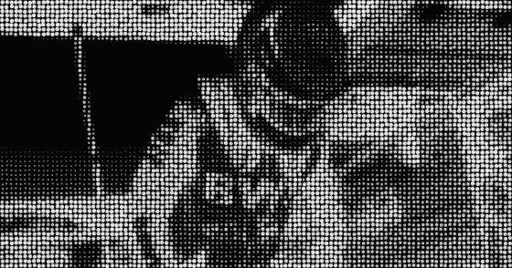

## Cursorify

Turn any image into a high‑contrast, pixel‑style composition (a dense grid of dots/characters forming a flag‑like image on a dark background). The app is a small web tool where you drop an image and instantly get back a stylized, Cursor‑inspired graphic you can download or reuse.

### Features

- **Image upload**: Drag and drop or pick any local image.
- **Automatic stylization**: Converts the source into a monochrome, high‑contrast grid pattern in the style of the provided sample image.
- **Live preview**: Tweak settings (e.g. grid density / contrast, depending on implementation) and see the result immediately.
- **Export**: Download the transformed image (e.g. as PNG) for wallpapers, posters, or sharing.

### Example

Original vs. Cursorified output for the same image:

**Original image**


**Cursorified image**



### Getting started

1. **Install dependencies**

   ```bash
   npm install
   # or
   yarn
   ```

2. **Run the development server**

   ```bash
   npm run dev
   # or
   yarn dev
   ```

3. Open `http://localhost:3000` in your browser and upload an image to start transforming it.

### Scripts

- **`npm run dev`**: Start the development server.
- **`npm run build`**: Create a production build.
- **`npm run start`**: Run the production server after building.
- **`npm run lint`**: Run linting checks.